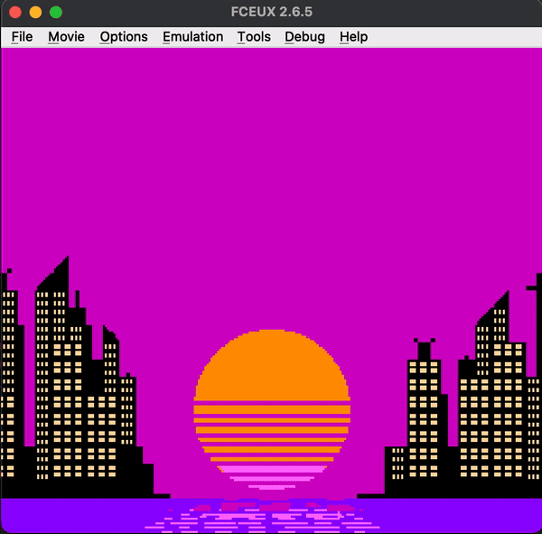

# sunset: Retro 80's Aesthetic
A 80's style sunset scene developed in 6502 assembly, designed to run on the NES (Nintendo Entertainment System).



## Prerequisites
To build and run the project, you’ll need the following tools:

- `cc65:` A complete set of tools to develop NES programs in assembly (assembler, linker, etc.)
- `NES Emulator:` (e.g., FCEUX) to test the scene if you don't have NES hardware.

## Building
```bash
make
```

## License

This project is licensed under the BSD 3-Clause License. See the LICENSE file for details.

